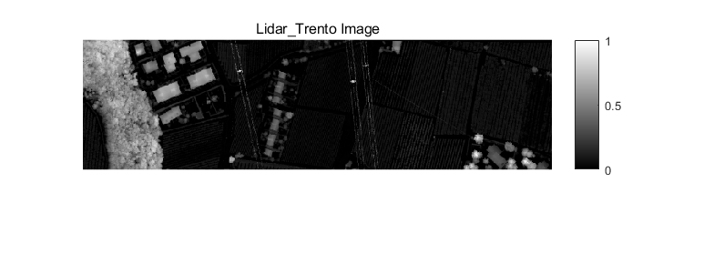

## Language

- zh_CN [简体中文](README.md)

- en [English](Readme/README_EN.md)

## Trento数据集

Trento数据集取自意大利南部城市Trento的农村地区。Trento数据集的空间分辨率为1 m,场景包含六种不同的土地覆盖:苹果树、建筑、地面、木材、葡萄园和道路。

LiDAR DSM数据由Optech ALTM 3100EA传感器采集，HSI数据由AISA Eagle传感器采集，两个传感器的空间分辨率均为1m，空间尺寸均为600×166像素。HSI具有402.89 ~ 989.09 nm范围内的63个光谱通道，其中光谱分辨率为9.2 nm。

## HSI data

HSI数据，即高光谱成像数据（Hyperspectral Imaging Data），通常由高光谱相机获取，是一种通过获取每个像素点的光谱信息来描述场景中物体的数据。高光谱成像数据可以用来对场景中的对象进行精确的表征和分类。这种数据包含了大量连续的光谱波段，通常在可见光和红外光谱范围内。

## AISA Eagle

AISA Eagle是一种高光谱成像传感器，用于测量上行辐射的空间分布。AISA Eagle的测量物种是大气辐射，测量方法是高光谱光栅光谱学。它的主要数量是反射率，次要数量是云粒子相态的空间分布。