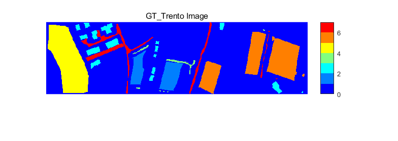
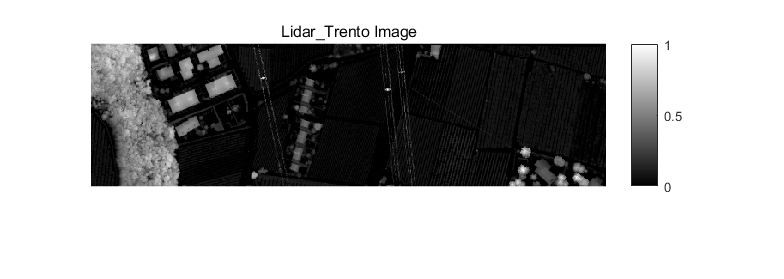
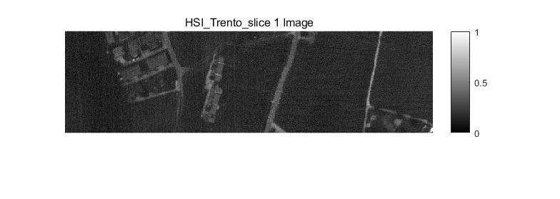

## Language

- zh_CN [简体中文](../README.md)

- en [English](readme/README_EN.md)

## Trento Dataset

The Trento dataset was taken from a rural area in the southern Italian city of Trento. The Trento dataset has a spatial resolution of 1 m, and the scenarios contain six different land covers: apple trees, buildings, ground, timber, vineyards, and roads.

The LiDAR DSM data was collected by the Optech ALTM 3100EA sensor, and the HSI data was collected by the AISA Eagle sensor. The spatial resolution of both sensors was 1m, and the spatial size of both sensors was 600×166 pixels. HSI has 63 spectral channels in the range of 402.89 to 989.09 nm, with a spectral resolution of 9.2 nm.

## HSI data

HSI Data, or Hyperspectral Imaging Data, usually obtained by a hyperspectral camera, is a type of data that describes an object in a scene by obtaining spectral information from each pixel. Hyperspectral imaging data can be used to accurately characterize and classify objects in a scene. This data contains a large number of continuous spectral bands, usually in the visible and infrared spectral ranges.

## AISA Eagle

AISA Eagle is a hyperspectral imaging sensor that measures the spatial distribution of ascending radiation. AISA Eagle's measured species is atmospheric radiation, measured using hyperspectral grating spectroscopy. Its main quantity is the reflectance, and its secondary quantity is the spatial distribution of the phase states of cloud particles.